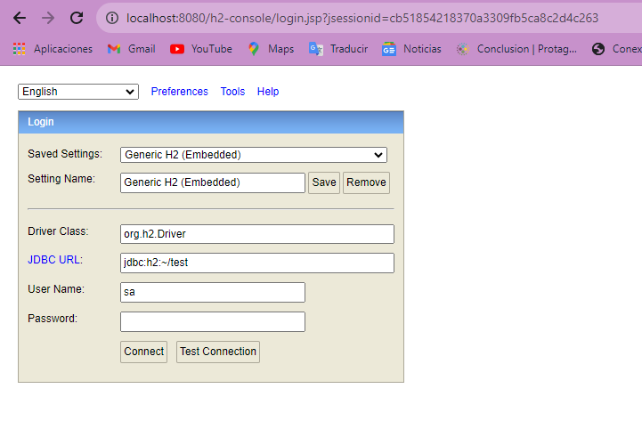

## Codelab: Persistencia en Memoria con H2


Al seguir las instrucciones en Spring y crear una pequeña base de datos en sql
obtenemos lo siguiente al ir a la url 

```
http://localhost:8080/h2-console/login.jsp?jsessionid=cb51854218370a3309fb5ca8c2d4c263
```



